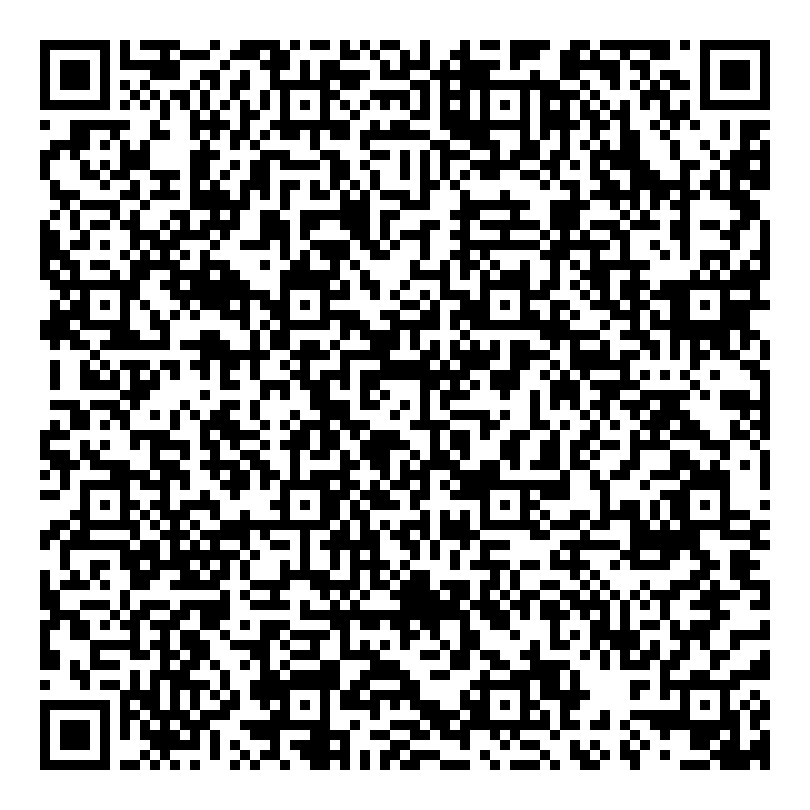
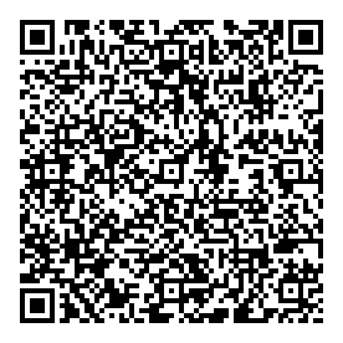
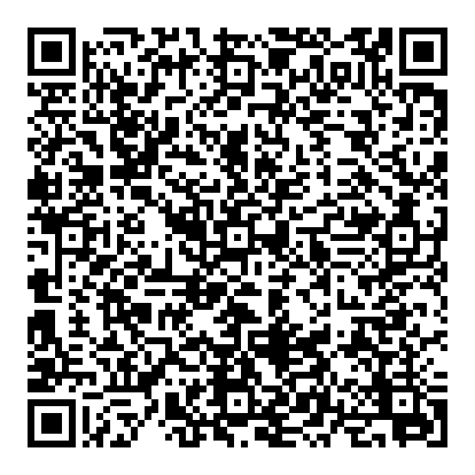
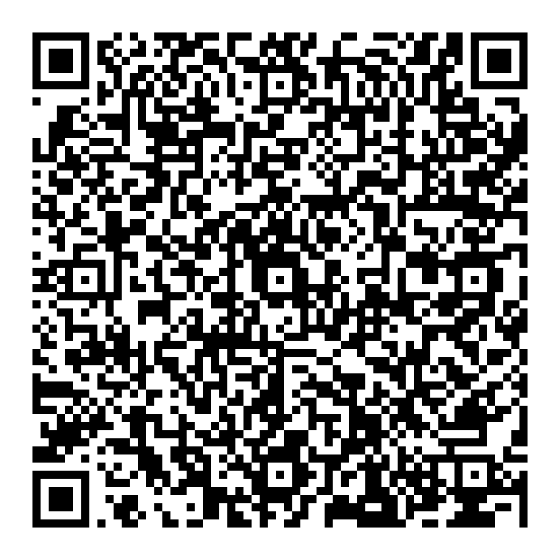
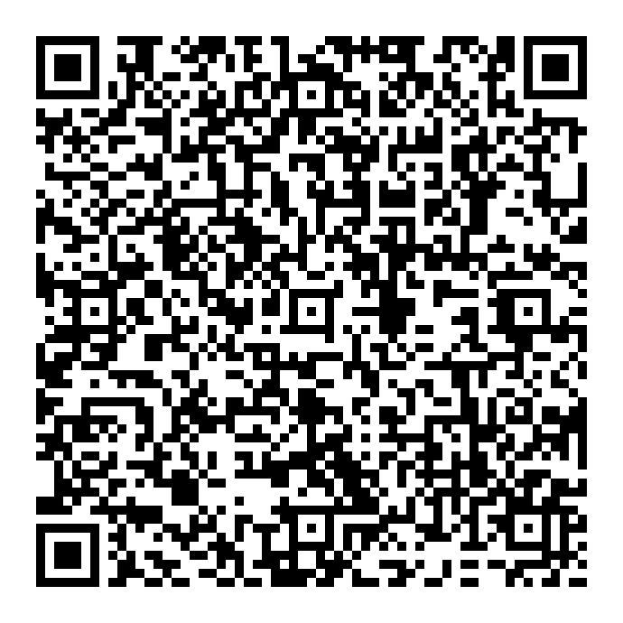
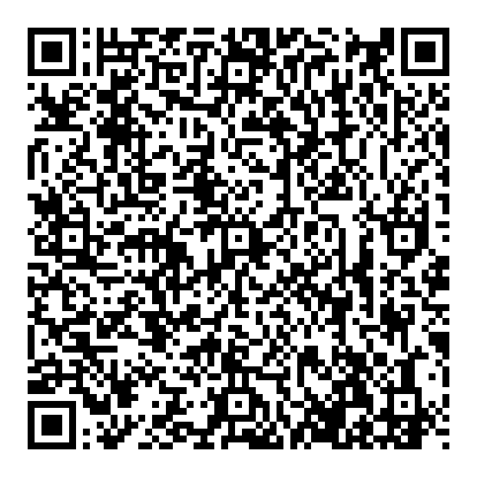
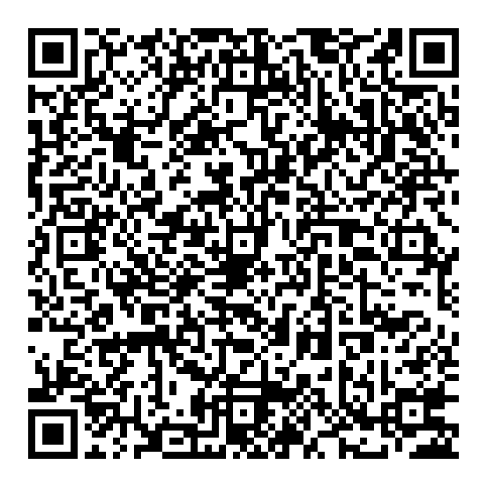
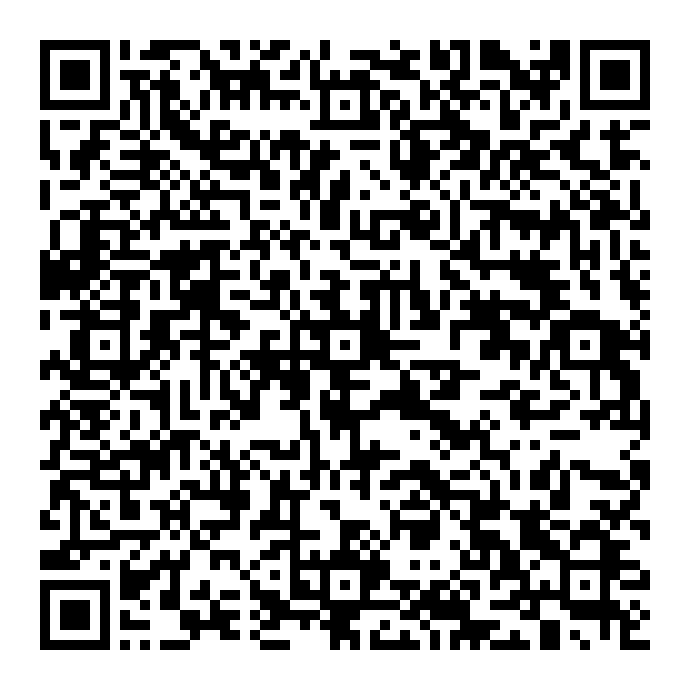
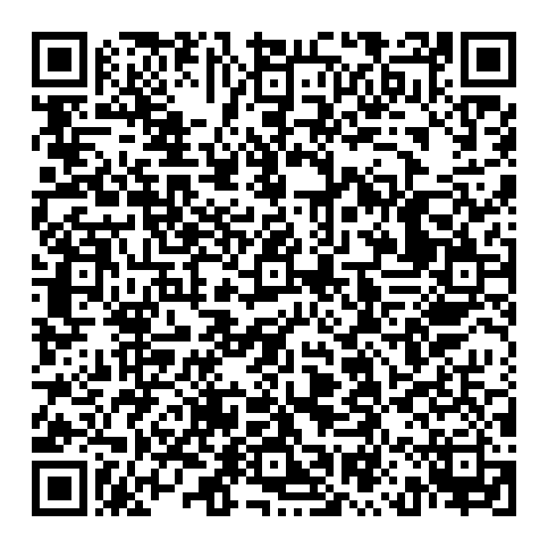

### Encrypted Message QR



---

### Share QR Codes

| Share 1 | Share 2 | Share 3 | Share 4 |
|---------|---------|---------|---------|
|  |  |  |  |

| Share 5 | Share 6 | Share 7 | Share 8 |
|---------|---------|---------|---------|
|  |  |  |  |

## Logs

```
Enter the number of shares to create: 8
Enter the threshold for reconstruction: 5
Enter the message to encrypt: Secret code: 37432
Encrypted Message: EncryptedMessage(id=5bH4sJnktjKvEPUXFI8d1g, ciphertext=ec3d7076de151088..., nonce=516fa7056b4b2590..., senderPublicKey=521eee7f87ee46dd..., createdAt=1750783615, threshold=5)
Share 1: Share(x=1, y=100409076435971344288621748506668226408805193194406509659619154105642951100263, messageId=5bH4sJnktjKvEPUXFI8d1g)
Share 2: Share(x=2, y=114021557126957452880670496086024537018984222432952775418493811422791221146634, messageId=5bH4sJnktjKvEPUXFI8d1g)
Share 3: Share(x=3, y=106947475868271813422016607117838441072836408655325147476659633668364403295795, messageId=5bH4sJnktjKvEPUXFI8d1g)
Share 4: Share(x=4, y=60019240591432713960524873677490185686099254275366128290693125153913456812871, messageId=5bH4sJnktjKvEPUXFI8d1g)
Share 5: Share(x=5, y=50708112451133871578543693432005376516352087535753055015886642888446163337640, messageId=5bH4sJnktjKvEPUXFI8d1g)
Share 6: Share(x=6, y=21540027404531934867510175741239830702843775677417471115181133960692931176631, messageId=5bH4sJnktjKvEPUXFI8d1g)
Share 7: Share(x=7, y=11679774631958981453345035556694723926665011770125754750233398156840991011026, messageId=5bH4sJnktjKvEPUXFI8d1g)
Share 8: Share(x=8, y=41138907326566269233755146472109016880662171297188804585882456651667298042709, messageId=5bH4sJnktjKvEPUXFI8d1g)
```
